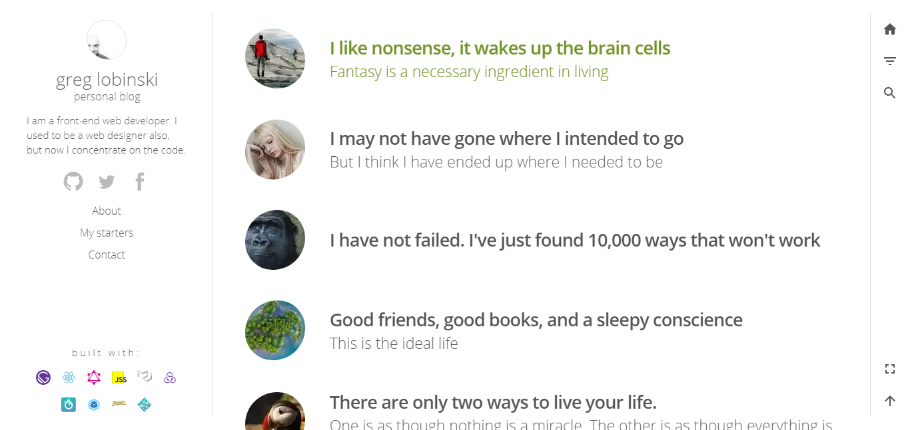

Tank-u is my first [Phaser.js](https://www.phaserjs.org/) game.

### Tank-U

A tower-defense game defending tanks from destroying everything. [Demo](https://lucasmcdaniel/tank-u) | [Github repo](https://github.com/lucasmcdaniel/tank-u)

### Vim customization

As the name says, it is my custom build of vim used for all of my development.
[Demo](https://lucasmcdaniel.com/) | [Github repo](https://github.com/lucasmcdaniel/.vim)
